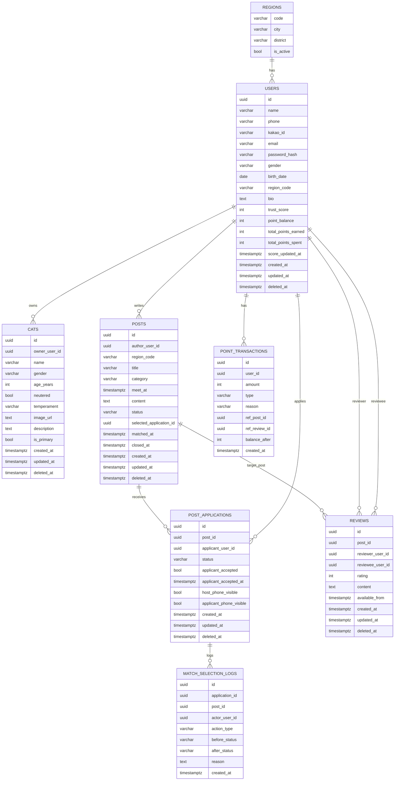

# Cat Meetup ERD

`cat-meetup` 시나리오(신규가입자/게시물작성자/신청자)를 기준으로 한 초기 ERD 초안입니다.
기준 DB는 PostgreSQL을 가정합니다.

## 1. ERD (Mermaid)

## 2. Enum/상태 정의
- `posts.category`: `돌봄 | 친구찾기 | 물품나눔`
- `posts.status`: `모집 | 매칭중 | 매칭완료`
- `post_applications.status`: `대기중 | 매칭중 | 매칭완료 | 실패`
- `cats.temperament`: `개냥이 | 수줍음 | 사나움`
- `point_transactions.type`: `적립 | 사용 | 차감 | 보정`

## 3. 핵심 제약 조건
- 회원 기본 정보
- `users.phone` UNIQUE (로그인 ID)
- `users.kakao_id`, `users.email` UNIQUE
- `users.region_code`는 `regions.code` 참조
- `users.trust_score` 기본값 100, 범위 0~1000 권장
- `users.point_balance` 기본값 0, 음수 불가

- 고양이 카드
- 1명의 사용자(`users`)는 N개의 고양이 카드(`cats`)를 가짐
- `is_primary = true`는 사용자당 최대 1개 권장 (Partial Unique Index)

- 게시물/신청
- 1개 게시물(`posts`)에 N명 신청(`post_applications`) 가능
- 같은 사용자의 동일 게시물 중복 신청 금지
  - UNIQUE (`post_id`, `applicant_user_id`)

- 매칭 선택
- 게시물 작성자가 1명 선택 시:
- 선택 신청자 `post_applications.status = 매칭중`
- 나머지 신청자 `post_applications.status = 실패`
- `posts.selected_application_id`에 선택 신청 PK 기록

- 매칭 완료
- 선택 신청자가 수락하면
- 선택 신청 `status = 매칭완료`
- 게시물 `status = 매칭완료`
- `posts.matched_at` 기록

## 4. 전화번호 노출 규칙(요구사항 반영)
- 기본: 서로 번호 비공개
- 신청자가 `매칭중`으로 선택되면 `host_phone_visible = true`
- 신청자가 수락하여 `매칭완료` 되면 `applicant_phone_visible = true`
- 즉, 작성자는 신청자 수락 전까지 신청자 번호를 모름

## 5. 매칭 변경 규칙(하루 1회)
- `match_selection_logs`에 매칭 변경 이력 저장
- 같은 `post_id` 기준, 작성자(`actor_user_id`)는 24시간 내 1회만 `action_type = reselection` 허용
- `posts.status = 매칭완료`이면 재선택 불가

## 6. 리뷰 규칙
- 리뷰는 일정 종료 다음날부터 작성 가능
- `reviews.available_from = posts.meet_at + interval '1 day'`
- 리뷰 생성 시점 >= `available_from` 검증

## 7. 점수/포인트 규칙
- 낮은 점수 신청 제한
- 예시 정책: `users.trust_score < 60` 이면 새 신청(`post_applications`) 생성 불가
- 운영 중 조정 가능하도록 임계값은 설정 테이블/환경변수로 분리 권장

- 점수 변화 트리거 예시
- 리뷰 평점 4~5점 누적: `trust_score` 가점
- 노쇼/신고 확정: `trust_score` 감점
- 매칭완료 + 리뷰 작성 완료: `point_balance` 적립
- 정책 위반: `point_balance` 차감

- 정합성
- 포인트 잔액(`users.point_balance`)은 `point_transactions.balance_after`와 일치해야 함
- `point_transactions.amount`는 적립(+), 사용/차감(-) 규칙 일관 적용

## 8. 인덱스 추천
- `posts(region_code, category, status, meet_at desc)`
- `post_applications(post_id, status)`
- `post_applications(applicant_user_id, status, created_at desc)`
- `reviews(reviewee_user_id, created_at desc)`
- `users(trust_score desc)`
- `point_transactions(user_id, created_at desc)`

## 9. 구현 메모
- 인증을 Supabase Auth로 할 경우 `users.id`를 auth user id(UUID)와 1:1 매핑
- 비밀번호를 앱 DB에서 직접 관리하지 않으면 `password_hash` 제거 가능
- 소프트 삭제 운영 시 모든 조회에 `deleted_at is null` 조건 공통 적용
- "점수 낮으면 신청 불가"는 DB CHECK만으로는 어려우므로 API(Service) 레이어 + DB 트리거 조합 권장
